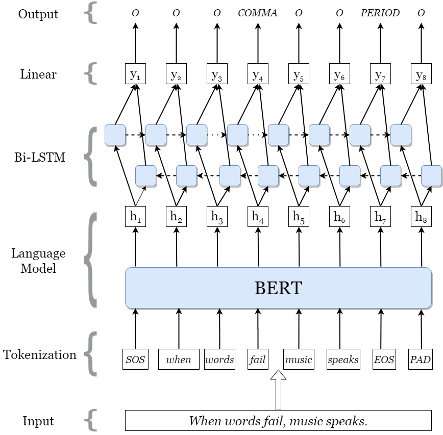

# Punctuation Restoration using Transformer Models

This repository contins official implementation of the paper [*Punctuation Restoration using Transformer Models for High-and Low-Resource Languages*](http://noisy-text.github.io/2020/pdf/2020.d200-1.18.pdf) accepted at the EMNLP workshop [W-NUT 2020](http://noisy-text.github.io/2020/).

This project improves upon the above model by experimenting on different heuristics. This is an internship project from May 2021 to July 2021 and my [*Student Internship Report*](https://github.com/CodyChew/punctuation-restoration/blob/branch-sliding-window/SIP%20Report%20.pdf) summarizes the findings for this project.


## Data

The data files are compressed into a single zip file which contains all the data splits that have been used.

#### IWSLT dataset (en)

The IWSLT dataset consists of transcriptions from TED talks. The training and development set consist of 2.1M and 296K words, respectively. Two test sets are provided with manual and ASR transcriptions, each containing 12626 and 12822 words, respectively. This dataset is used in the above study in which I will also use the same splits for my experiments.

#### Switchboard dataset (utt)

1155 5-minute conversations that are manually labelled from the Switchboard corpus of telephone conversations. The splits I use changes throughout the course of my internship. Originally, I have a split which simply splits the whole continuous file into 3 files resulting in a 1.1M, 294K, 163K set split. Next, the training, dev and test sets are sampled by conversations, and then merged into single files resulting in 220K train, 500K dev, 912K test sets in number of words.

#### LJ Speech dataset

This is a [public domain speech dataset](https://keithito.com/LJ-Speech-Dataset/) consisting of 13,100 short audio clips of a single speaker reading passages from 7 non-fiction books. A transcription is provided for each clip. Clips vary in length from 1 to 10 seconds and have a total length of approximately 24 hours. The train, dev and test sets were split by sampling blocks of 1000 words, resulting in 45K train, 16K dev and 160K test sets in number of words.

## Data Processing

The data processing file contains all the files that deal with processing of data, including plotting of results and processing of original data files

## Model Architecture
A Transformer architecture based language model is used for this task and it is taken from the above paper [*Punctuation Restoration using Transformer Models for High-and Low-Resource Languages*](http://noisy-text.github.io/2020/pdf/2020.d200-1.18.pdf).
Transformer encoder is followed by a bidirectional LSTM and linear layer that predicts target punctuation token at
each sequence position.



## Dependencies
Install PyTorch following instructions from [PyTorch website](https://pytorch.org/get-started/locally/). Remaining
dependencies can be installed with the following command
```bash
pip install -r requirements.txt
```


## Training
To train punctuation restoration model with optimal parameter settings for English run the following command
```
python src/train.py --cuda=True --pretrained-model=roberta-large --freeze-bert=False --lstm-dim=-1 
--language=english --seed=1 --lr=5e-6 --epoch=10 --augment-type=all  --augment-rate=0.15 
--alpha-sub=0.4 --alpha-del=0.4 --data-path=data --save-path=out --sliding-window=True
```

#### Supported models for English
```
bert-base-uncased
bert-large-uncased
bert-base-multilingual-cased
bert-base-multilingual-uncased
xlm-mlm-en-2048
xlm-mlm-100-1280
roberta-base
roberta-large
distilbert-base-uncased
distilbert-base-multilingual-cased
xlm-roberta-base
xlm-roberta-large
albert-base-v1
albert-base-v2
albert-large-v2
```

## Pretrained Models
You can find pretrained mdoels for RoBERTa-large model with augmentation for English [here](https://drive.google.com/file/d/17BPcnHVhpQlsOTC8LEayIFFJ7WkL00cr/view?usp=sharing)  
XLM-RoBERTa-large model with augmentation for Bangla can be found [here](https://drive.google.com/file/d/1X2udyT1XYrmCNvWtFpT_6jrWsQejGCBW/view?usp=sharing)


## Inference
You can run inference on unprocessed text file to produce punctuated text using `inference` module. Note that if the 
text already contains punctuation they are removed before inference. 

Example script for English:
```bash
python inference.py --pretrained-model=roberta-large --weight-path=roberta-large-en.pt --language=en 
--in-file=data/test_en.txt --out-file=data/test_en_out.txt
```
This should create the text file with following output:
```text
Tolkien drew on a wide array of influences including language, Christianity, mythology, including the Norse Völsunga saga, archaeology, especially at the Temple of Nodens, ancient and modern literature and personal experience. He was inspired primarily by his profession, philology. his work centred on the study of Old English literature, especially Beowulf, and he acknowledged its importance to his writings. 
```

Please note that *Comma* includes commas, colons and dashes, *Period* includes full stops, exclamation marks 
and semicolons and *Question* is just question marks. 


## Test
Trained models can be tested on processed data using `test` module to prepare result.

For example, to test the best preforming English model run following command
```bash
python src/test.py --pretrained-model=roberta-large --lstm-dim=-1 --use-crf=False --data-path=data/test
--weight-path=weights/roberta-large-en.pt --sequence-length=256 --save-path=out
```
Please provide corresponding arguments for `pretrained-model`, `lstm-dim`, `use-crf` that were used during training the
model. This will run test for all data available in `data-path` directory.


## Cite this work

```
@inproceedings{alam-etal-2020-punctuation,
    title = "Punctuation Restoration using Transformer Models for High-and Low-Resource Languages",
    author = "Alam, Tanvirul  and
      Khan, Akib  and
      Alam, Firoj",
    booktitle = "Proceedings of the Sixth Workshop on Noisy User-generated Text (W-NUT 2020)",
    month = nov,
    year = "2020",
    address = "Online",
    publisher = "Association for Computational Linguistics",
    url = "https://www.aclweb.org/anthology/2020.wnut-1.18",
    pages = "132--142",
}
```
